<picture>
  <source media="(prefers-color-scheme: dark)" srcset="assets/hero-dark.svg">
  <source media="(prefers-color-scheme: light)" srcset="assets/hero-light.svg">
  
</picture>

### I build software that has to work outside the demo.

CS student at Newton School of Technology, Bangalore. I take ideas from a rough sketch to something people can run, then check whether it actually works. Recent work has taken me from a C++ camera-control loop to AI agents that pay for outcomes over x402 to Rust terminal internals.

[awoken.in](https://awoken.in) · [LinkedIn](https://linkedin.com/in/kirtan-joshi2412) · [Email](mailto:kirtan120007@gmail.com) · [Pull requests](https://github.com/search?q=author%3AThatKJ+is%3Apr+-user%3AThatKJ&type=pullrequests)

```text
building      Awoken · AI lead follow-up
exploring     agents that pay, verify, retry
contributing  focused upstream fixes
aiming        GSoC 2027
```

## Selected work

### Awoken &nbsp;<sub>early-stage venture</sub>

**AI follow-up for real-estate sales teams.** Teams pay for leads, then lose them to one unanswered call and a flood of newer ones. Awoken starts with the leads a team has already written off (a CSV export is enough), re-engages them over WhatsApp, qualifies project, budget, location and timeline, and hands interested buyers back to sales with the conversation attached. It sits alongside the CRM instead of replacing it.

<sub>Next.js · TypeScript · Tailwind · Supabase</sub><br>
[awoken.in ↗](https://awoken.in)

### Margin402 &nbsp;<sub>hackathon prototype · Algorand Testnet</sub>

**An AI agent buys a verified outcome at a fixed price, not every failed attempt.** Margin402 picks a provider, pays it over x402, checks the result against hidden tests, and retries or escalates until it passes. If the run costs more than the contract, Margin402 absorbs the loss: one documented run charged $1.20, spent $1.28 across four provider payments, and returned code passing 8/8 tests.

Every payment is a real x402 round-trip (402 → sign → verify → settle) on Algorand Testnet, with job state in Redis. The provider market is simulated, and the repo says so.

<sub>TypeScript · Next.js · x402 · Algorand · Redis</sub><br>
[live demo ↗](https://margin402.vercel.app) · [source](https://github.com/ThatKJ/margin402)

### FSOC &nbsp;<sub>simulation · Smart India Hackathon 2026</sub>

**Keeping a moving optical terminal pointed at its receiver using only a camera.** Built with Team IRODOV for ISRO's SIH26169 problem statement. A C++20 closed loop renders a moving beacon, detects it (classical, a 27k-parameter ONNX network through OpenCV DNN, or a hybrid), gates detections with an alpha–beta tracker, and steers a rate-limited virtual pan/tilt camera with PID. A Next.js Mission Control makes every run inspectable.

In simulation, closing the loop cut RMS pointing error from 6.45° to 0.55°. The tracker removed about 99.5% of severe outliers but cost 20 points of detection coverage. The repo documents that tradeoff instead of hiding it. Real-camera input is in progress.

<sub>C++20 · OpenCV · ONNX · CMake · Next.js</sub><br>
[source](https://github.com/ThatKJ/FSOC) · [results](https://github.com/ThatKJ/FSOC#measured-results) · [Mission Control ↗](https://fsoc-iota.vercel.app)

### GEC Platform &nbsp;<sub>interactive explainer</sub>

**An ESP32 electricity-monitoring rig, explained in 3D.** Four pages walk through the hardware, signal path, waveforms and circuit schematic of an ACS712 / ZMPT101B voltage-and-current sensing system.

<sub>Next.js · TypeScript · Three.js</sub><br>
[live ↗](https://gec-platform.vercel.app) · [source](https://github.com/ThatKJ/gec-platform)

## Open source

I learn by working inside codebases I didn't design: reproduce the problem, find the layer it actually lives in, make the smallest change that fixes it, and prove it with tests.

 &nbsp;**[HADES CLI #32](https://github.com/PareekshithPalat/HADES_CLI/pull/32)** · Rust<br>
Restored native text selection and copy in the terminal UI. Root cause: the TUI enabled global mouse capture at startup even though every interaction is keyboard-driven, so terminals sent drags to the app instead of selecting text. Removed the capture on init, kept the cleanup on exit.<br>
<sub>Ratatui · Crossterm</sub>

 &nbsp;**[HADES CLI #30](https://github.com/PareekshithPalat/HADES_CLI/pull/30)** · Rust<br>
Added `/export` and `/import` for conversation history. Exports Markdown or JSON; imports HADES exports, ChatGPT `conversations.json`, Claude transcripts and generic Markdown, with format detection, and restores them into the active context. Spans the storage, core and TUI crates.<br>
<sub>serde · CLI commands · multi-crate workspace</sub>

 &nbsp;**[awesome-ai-apps #317](https://github.com/Arindam200/awesome-ai-apps/pull/317)** · Python<br>
Fixed a FastAPI service that paired a wildcard CORS origin with `allow_credentials=True`. Origins now come from an explicit allow-list that fails closed when unset, with regression tests for the edge cases raised in review.<br>
<sub>FastAPI · CORS · pytest</sub>

 &nbsp;**[Node.js #66376](https://github.com/nodejs/node/pull/66376)** · C++<br>
Backports two V8 fixes for a wasm import-wrapper lifetime race to `v24.x-staging`. A wrapper already marked as dying could be re-added to a `WasmCodeRefScope`, tripping a JIT allocation `CHECK`. An independent tester reported 0 crashes in 191 repro runs with the patch, versus 8 in 149 without.<br>
<sub>V8 · WebAssembly · memory lifetimes</sub>

 &nbsp;**[LLMVault #44](https://github.com/CyberSunil/LLMVault/pull/44)** · Python<br>
Brute-force protection for flag submissions: per-player, per-challenge attempt tracking, a 30-second cooldown after five misses, and HTTP 429 with `retry_after`. 19 tests.

## More things I've built

| Project | What it is | Stack |
|---|---|---|
| [ChallanCheck](https://github.com/ThatKJ/challancheck) | Checks whether a traffic e-challan's photo actually shows the cited violation. A vision API observes; deterministic rules decide. | JavaScript · AWS Lambda · Rekognition |
| [Beacontra](https://github.com/ThatKJ/Beacontra) | Ranks marketplace listings for brand review by combining price, seller and reverse-image evidence. | TypeScript · SerpApi |
| [Intervu](https://github.com/ThatKJ/team-vector) | Adaptive interview engine: each answer updates a model of what the candidate knows and picks the next question. 48-hour team build. | Next.js · TypeScript · Supabase |
| [ring-escape](https://github.com/ThatKJ/ring-escape) | Arcade game: rotate concentric rings to guide a ball out of the maze. | Python · Pygame |
| [Portfolio](https://portfolio-kirtan.vercel.app) | Personal site. | React · Vite · Framer Motion |
| [FolderPrettifier](https://github.com/ThatKJ/FolderPrettifier) | Sorts a messy folder by file type without overwriting duplicates. | Python |
| [Airline Reservation System](https://github.com/ThatKJ/Airline-Reservation-System) | Terminal booking system with user and admin roles. School group project. | Python · MySQL |

## Toolbox

`LANGUAGES` &nbsp;TypeScript · Python · C++ · JavaScript · Rust<br>
`PRODUCT` &nbsp;Next.js · React · Tailwind · Three.js · Framer Motion<br>
`VISION` &nbsp;OpenCV DNN · ONNX · CMake<br>
`DATA / INFRA` &nbsp;Supabase · PostgreSQL · Redis · MySQL · AWS Lambda<br>
`AGENTS / PAYMENTS` &nbsp;x402 · Algorand

## How I work

**Understand the problem → build the smallest useful version → test it against reality → fix the right layer.**

That's why FSOC publishes its counterexamples next to its best numbers, Margin402 has a "what is real vs. simulated" table, and my pull requests start with the root cause.

---

**Working on something where the interface, the backend and the failure cases all matter?** I'd like to hear about it.

[Email](mailto:kirtan120007@gmail.com) · [LinkedIn](https://linkedin.com/in/kirtan-joshi2412) · [X](https://x.com/kirtan026832614) · [awoken.in](https://awoken.in)
