<a href="https://awoken.in"><b>awoken.in</b></a>&emsp;
<a href="https://linkedin.com/in/kirtan-joshi2412"><b>LinkedIn</b></a>&emsp;
<a href="mailto:kirtan120007@gmail.com"><b>Email</b></a>&emsp;
<a href="https://x.com/kirtan026832614"><b>X</b></a>&emsp;
<a href="https://github.com/search?q=author%3AThatKJ+is%3Apr+-user%3AThatKJ&type=pullrequests"><b>Pull requests</b></a>

CS student at Newton School of Technology. I take ideas from a rough sketch to something people can run, then check whether it actually works. Recent work has taken me from a C++ camera-control loop to AI agents that pay for outcomes over x402 to Rust terminal internals.

 

<picture>
  <source media="(prefers-color-scheme: dark)" srcset="assets/h-work-dark.svg">
  <source media="(prefers-color-scheme: light)" srcset="assets/h-work-light.svg">
  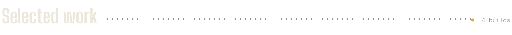
</picture>

<a href="https://awoken.in">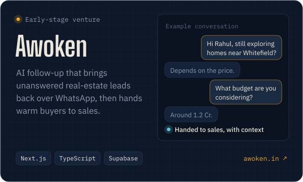</a>
<a href="https://margin402.vercel.app">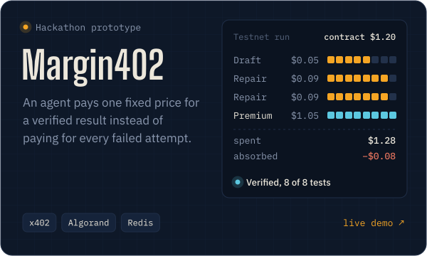</a>
<a href="https://github.com/ThatKJ/FSOC">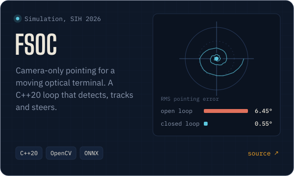</a>
<a href="https://gec-platform.vercel.app">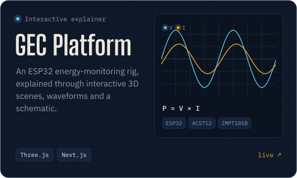</a>

Source: <a href="https://github.com/ThatKJ/margin402">margin402</a>, <a href="https://github.com/ThatKJ/FSOC">FSOC</a>, <a href="https://github.com/ThatKJ/gec-platform">gec-platform</a>. FSOC was built with Team IRODOV for ISRO's SIH26169 problem statement; its numbers are recorded simulation results, and <a href="https://github.com/ThatKJ/FSOC#measured-results">the repo documents the tradeoffs</a>. Margin402's provider market is simulated; its payments are real Algorand Testnet transactions.

  

<picture>
  <source media="(prefers-color-scheme: dark)" srcset="assets/h-oss-dark.svg">
  <source media="(prefers-color-scheme: light)" srcset="assets/h-oss-light.svg">
  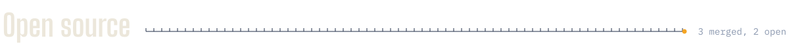
</picture>

<a href="https://github.com/search?q=author%3AThatKJ+is%3Apr+-user%3AThatKJ&type=pullrequests">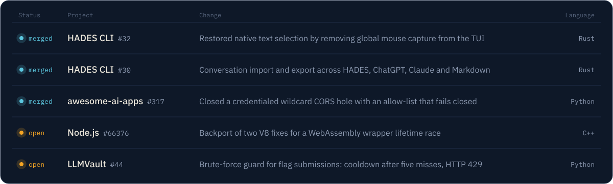</a>

<b>What changed in each pull request</b>

 

**[HADES CLI #32](https://github.com/PareekshithPalat/HADES_CLI/pull/32)** (merged). The TUI enabled global mouse capture at startup even though every interaction is keyboard-driven, so terminals sent drags to the app instead of selecting text. Removed the capture on init and kept the cleanup on exit. Ratatui, Crossterm.

**[HADES CLI #30](https://github.com/PareekshithPalat/HADES_CLI/pull/30)** (merged). Added `/export` and `/import`. Exports Markdown or JSON; imports HADES exports, ChatGPT `conversations.json`, Claude transcripts and generic Markdown with format detection, then restores them into the active context. Spans the storage, core and TUI crates.

**[awesome-ai-apps #317](https://github.com/Arindam200/awesome-ai-apps/pull/317)** (merged). A FastAPI service paired a wildcard CORS origin with `allow_credentials=True`. Origins now come from an explicit allow-list that fails closed when unset, with regression tests for the edge cases raised in review.

**[Node.js #66376](https://github.com/nodejs/node/pull/66376)** (open). Backports two V8 fixes to `v24.x-staging`: a wrapper already marked as dying could be re-added to a `WasmCodeRefScope`, tripping a JIT allocation `CHECK`. An independent tester reported 0 crashes in 191 repro runs with the patch, versus 8 in 149 without.

**[LLMVault #44](https://github.com/CyberSunil/LLMVault/pull/44)** (open). Per-player, per-challenge attempt tracking, a 30-second cooldown after five misses, and HTTP 429 with `retry_after`. 19 tests.

 

<picture>
  <source media="(prefers-color-scheme: dark)" srcset="assets/h-more-dark.svg">
  <source media="(prefers-color-scheme: light)" srcset="assets/h-more-light.svg">
  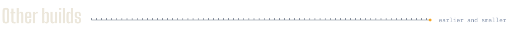
</picture>

| Project | What it is | Stack |
|---|---|---|
| [ChallanCheck](https://github.com/ThatKJ/challancheck) | Checks whether a traffic e-challan's photo actually shows the cited violation. A vision API observes; deterministic rules decide. | JavaScript, AWS Lambda, Rekognition |
| [Beacontra](https://github.com/ThatKJ/Beacontra) | Ranks marketplace listings for brand review by combining price, seller and reverse-image evidence. | TypeScript, SerpApi |
| [Intervu](https://github.com/ThatKJ/team-vector) | Adaptive interview engine: each answer updates a model of what the candidate knows and picks the next question. 48-hour team build. | Next.js, TypeScript, Supabase |
| [ring-escape](https://github.com/ThatKJ/ring-escape) | Arcade game: rotate concentric rings to guide a ball out of the maze. | Python, Pygame |
| [Portfolio](https://portfolio-kirtan.vercel.app) | Personal site. | React, Vite, Framer Motion |
| [FolderPrettifier](https://github.com/ThatKJ/FolderPrettifier) | Sorts a messy folder by file type without overwriting duplicates. | Python |
| [Airline Reservation System](https://github.com/ThatKJ/Airline-Reservation-System) | Terminal booking system with user and admin roles. School group project. | Python, MySQL |

 

<picture>
  <source media="(prefers-color-scheme: dark)" srcset="assets/h-tools-dark.svg">
  <source media="(prefers-color-scheme: light)" srcset="assets/h-tools-light.svg">
  
</picture>

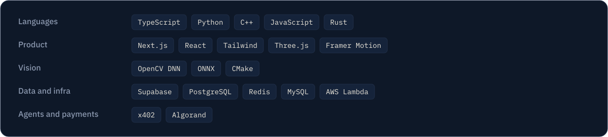

  

<picture>
  <source media="(prefers-color-scheme: dark)" srcset="assets/h-how-dark.svg">
  <source media="(prefers-color-scheme: light)" srcset="assets/h-how-light.svg">
  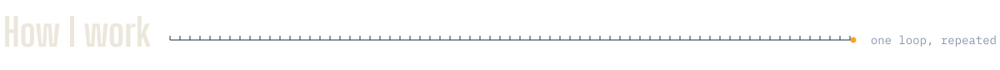
</picture>

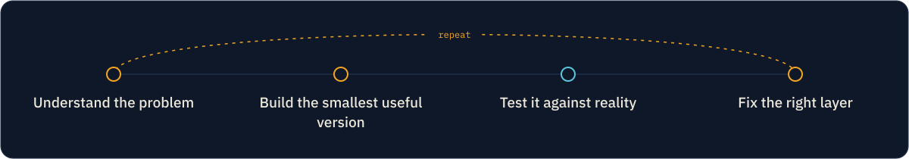

That's why FSOC publishes its counterexamples next to its best numbers, Margin402 has a "what is real vs. simulated" table, and my pull requests start with the root cause.

 

<a href="mailto:kirtan120007@gmail.com">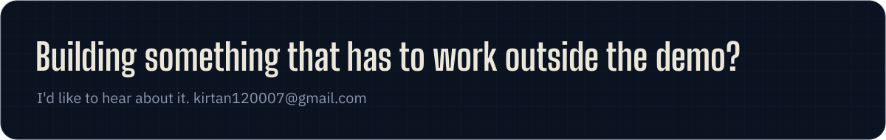</a>
